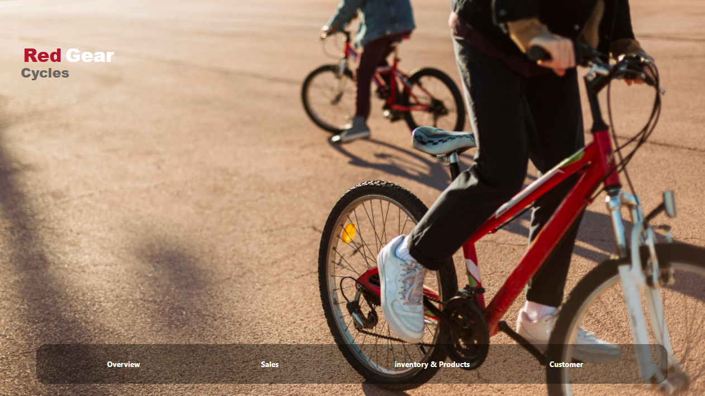
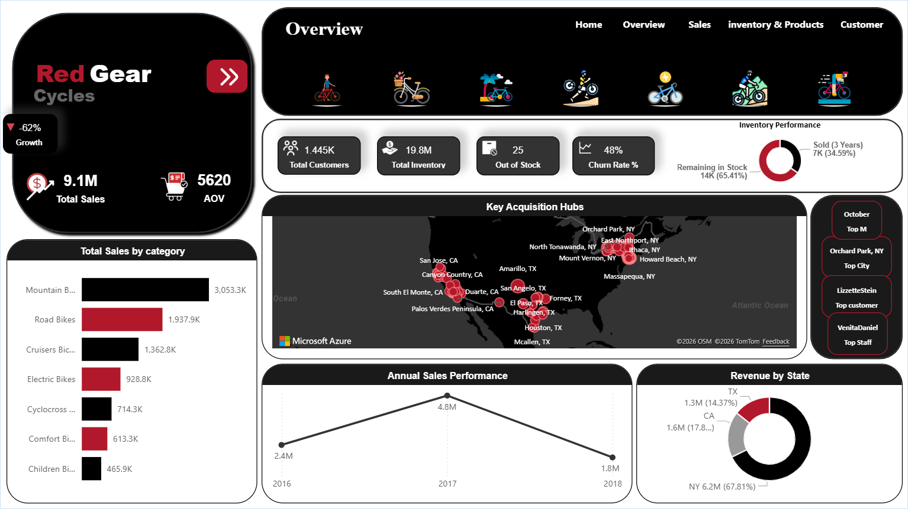
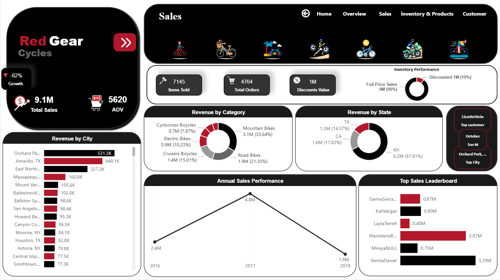
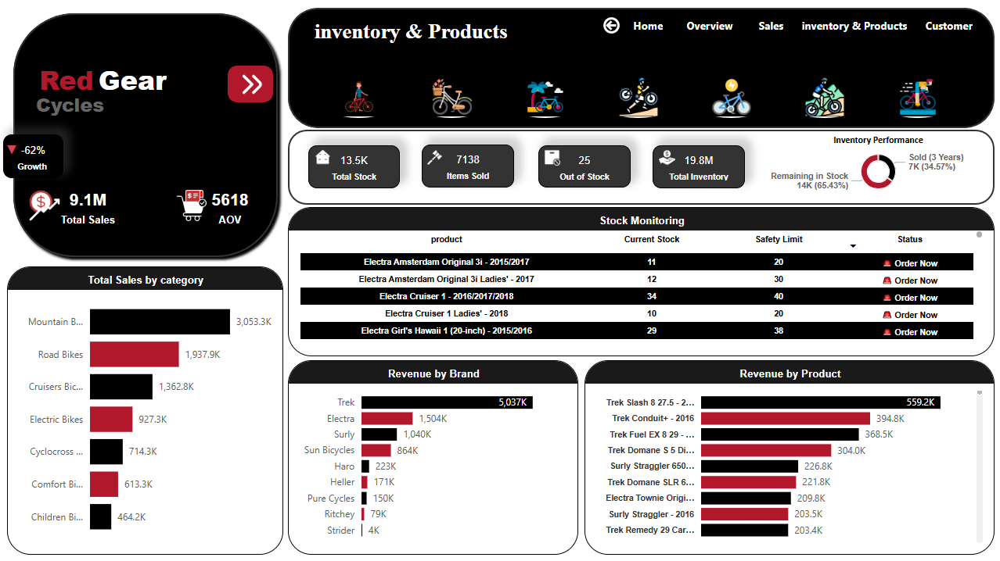
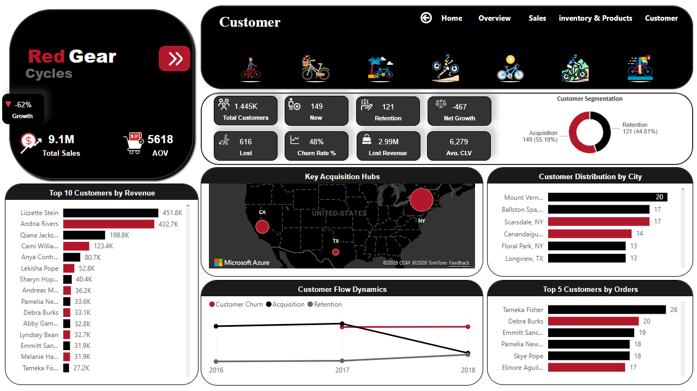

# 🚴 Red Gear Cycles — Sales & Customer Analytics Dashboard


---

## 📌 Project Overview

A comprehensive **business intelligence solution** built for **Red Gear Cycles**, a bicycle retail company operating across **NY, CA, and TX** (2016–2018). This project covers the **entire data pipeline**—from database cleaning and transformation to strategic insights and interactive visualization.

### 🎯 Key Metrics at a Glance

| Metric | Value | Change |
|--------|-------|--------|
| 💰 Total Revenue | $9.1M | -30% (2017→2018) |
| 👥 Customer Base | 1,445 | -467 net growth (2018) |
| 📉 Churn Rate | 48% | Lost 616 customers |
| 💸 Lost Revenue | $2.99M | From churned customers |
| 📦 Out of Stock | 25 products | Missed opportunities |

---

## 🔍 Strategic Business Insights

### 🚨 1. The May 2018 Mystery & Operational Collapse

**The Issue:**  
A sudden, unexplained drop to **zero sales** in May 2018. This wasn't a market trend; it was a total operational **"paralysis."**

**The Impact:**  
The company lost its momentum entirely, causing a **30% annual revenue decline** ($2.6M in 2017 to $1.8M in 2018).

**Root Cause Analysis:**  
This signals a critical failure in either the **supply chain** (stock-out) or **internal management** during that specific month.

**Recommendation:**  
Conduct a full audit of May 2018 operations — investigate vendor relationships, staffing changes, and inventory management systems.

---

### 🚲 2. The "Luxury Trap" Product Strategy

**The Issue:**  
A strategic pivot toward **ultra-high-end models** (up to **$12,000**) while neglecting the core **"Hero Products"** ($2.5K–$4K range).

**The Impact:**  
This led to a staggering **97% drop in sales volume**. The company effectively traded its loyal mass-market for a tiny luxury niche that couldn't sustain the business.

**Recommendation:**  
**Re-stabilize the portfolio** by re-introducing mid-range bestsellers to win back the core customer segment. Keep luxury as a supplement, not the foundation.

---

### 🗺️ 3. Geographic Over-dependency & Missed Lifeboats

**The Issue:**  
Excessive reliance on **New York (67.8% of revenue)**, leaving the company vulnerable to regional shocks.

**The Opportunity:**  
**California** and **Texas**—major biking hubs—were severely underutilized. California, especially, showed weak performance despite being the **global center for Mountain Bikes** (the company's top category).

**Recommendation:**  
Shift marketing focus to CA and TX to **diversify risk** and tap into high-growth biking communities. Consider pop-up stores or regional partnerships.

---

### 👥 4. The $2.99M Customer Leak (Retention Crisis)

**The Issue:**  
A **48% Churn Rate**. Nearly half of the customers who bought once **never came back**.

**The Financial Toll:**  
This "leaky bucket" resulted in **$2.99M in lost potential revenue** (Customer Lifetime Value). Losing **616 customers** in one year is a direct threat to long-term survival.

**Action Plan:**  
- Implement a **"Win-back" campaign** targeting the 616 lost customers
- Launch a **VIP Loyalty Program** — the top 10% of customers currently drive ~50% of total revenue
- Fix the fundamentals: product quality, customer service, and post-purchase engagement

---

## 📊 Dashboard Pages

### 🏠 1. Overview
High-level business snapshot with geographic distribution and sales trends.

**Key Visuals:**
- 🗺️ Customer Acquisition Hubs (Interactive Map)
- 📉 Annual Sales Performance (2016–2018)
- 🍩 Revenue by State
- 📊 Sales by Product Category

---

### 💰 2. Sales
Deep dive into revenue streams, team performance, and customer segments.

**Key Metrics:**
- Items Sold: 7,138
- Total Orders: 4,760
- Discounts: $1M
- Top Rep: Venita Daniel ($3.29M — 36% of sales)

**Key Visuals:**
- 🏆 Sales Leaderboard
- 🍩 Revenue by Category
- 📍 Top Cities by Revenue

---

### 📦 3. Inventory & Products
Stock monitoring with alerts and brand performance analysis.

**Key Metrics:**
- Total Units: 13.5K
- Inventory Value: $19.8M
- Out of Stock: 25 products
- Top Brand: Trek ($5.037M)

**Key Visuals:**
- ⚠️ Stock Monitoring Table (Auto-alerts)
- 📊 Revenue by Brand
- 🍩 Inventory Movement (Sold vs Remaining)

---

### 👥 4. Customer
Customer lifecycle, segmentation, and retention analysis.

**Key Metrics:**
- New Customers (2018): 149
- Retained: 121
- Churn Rate: 48%
- Avg. CLV: $6,279

**Key Visuals:**
- 📈 Customer Flow Dynamics (Acquisition / Retention / Churn)
- 🍩 Customer Segmentation
- 🏆 Top 10 Customers by Revenue
- 🗺️ Geographic Distribution

---

## 🛠️ Technical Stack & Methodology

### 🗄️ SQL — Data Cleaning & Preparation
**Used for initial data cleaning:**
- Removing duplicates and handling NULL values
- Standardizing data formats (dates, text, numbers)
- Data validation and integrity checks
- Exporting clean CSV files for Power BI

```sql
-- Handling Duplicates using CTE and Window Functions
WITH duplicates AS (
  SELECT *,
         ROW_NUMBER() OVER (PARTITION BY product_id ORDER BY product_name) AS rn
  FROM products
)
DELETE FROM duplicates
WHERE rn > 1;

-- Standardizing City and State Formatting
UPDATE customers 
SET city = UPPER(TRIM(city)),
    state = UPPER(TRIM(state));
```

---

### 🔄 Power Query — Data Transformation & Modeling
- Imported cleaned CSV files into Power BI
- Established relationships between tables (star schema)
- Created calculated columns for analysis
- Geocoding customer addresses (latitude/longitude)
- Data type optimization for performance
- Final data shaping and type optimization
- Geocoding customer addresses (latitude/longitude)
- Data type conversions for DAX efficiency

---

### 📊 Power BI & DAX — Advanced Analytics

```dax
-- Churn Rate % = 
-- 1. select year
VAR SelectedYearNum = 
    IF(
        ISFILTERED('orders'[order_date].[Year]), 
        VALUE(SELECTEDVALUE('orders'[order_date].[Year])), 
        2018
    )

-- 2. Lost Customers
VAR Lost = [Lost Customers (Final Fix)]

-- 3. Total active customers prior to the specified year
VAR ActiveBeforeYear = 
    CALCULATE(
        DISTINCTCOUNT('orders'[customer_id]),
        ALL('orders'),
        YEAR('orders'[order_date]) < SelectedYearNum
    )

-- 4. calculates
RETURN
IF(
    ActiveBeforeYear > 0,
    DIVIDE(Lost, ActiveBeforeYear, 0),
    BLANK()
)

-- Customer Lifetime Value
Avg. CLV = 
DIVIDE(
    [Total Sales], 
    DISTINCTCOUNT('orders'[customer_id]), 
    0
)

-- Net Customer Growth
Net Growth = [New Customers] - [Lost Customers]
```

---

## 🗂️ Data Model

```
customers ─────────────┐
                       │
orders ────────────────┼─── order_items
    │                  │
    │                  └── products ─── stocks
    │                          │
    └── stores ─── staff       └── brands
             │                      │
             └──────────────────────┘
                    categories
```

**9 Tables | Star Schema | Optimized Relationships**

---

## 📁 Project Structure & Privacy

```
RedGearCycles-Dashboard/
│
├── 📊 RedGearCycles.pbix          # Power BI file (private)
├── 📄 README.md                   # This file
│
├── 📂 sql/
│   ├── data_cleaning.sql          # Data preparation
│
├── 📂 data/
│   ├── tables(9).csv     
│
│── 📂 media/
│    ├── video.mp4
│
└── 📂 screenshots/
    ├── 01_home.png
    ├── 02_overview.png
    ├── 03_sales.png
    ├── 04_inventory.png
    └── 05_customer.png
```

### 🔒 Privacy Note
To protect intellectual property and analytical methodology:
- ✅ **Demo Video** available: [Link to demo]
- ✅ **Screenshots** included in `/screenshots`
- ✅ **SQL Scripts** shared for data cleaning transparency
- ✅ **DAX Measures** documented in README
- ⚠️ **`.pbix` file** kept private

For a **live walkthrough** or collaboration, reach out via LinkedIn.

---

## 📸 Screenshots

| Page | Preview |
|------|---------|
| 🏠 home |  |
| 🏠 Overview |  |
| 💰 Sales |  |
| 📦 Inventory |  |
| 👥 Customer |  |

---

## 🚀 Key Learnings

### Technical Skills:
✅ **SQL for Data Cleaning** — Removing duplicates, handling NULLs, standardization
✅ **Power Query Mastery** — Data modeling, transformations, and relationships
✅ **DAX Proficiency** — Advanced measures, time intelligence, filter context
✅ **Data Visualization** — Interactive dashboards, drill-through, tooltips
✅ **Storytelling** — Transforming data into strategic insights

### Business Acumen:
✅ **Churn Analysis** — Identified $2.99M revenue leak
✅ **Product Strategy** — Balanced portfolio recommendations
✅ **Customer Segmentation** — VIP vs regular analysis
✅ **Operational Insights** — Supply chain and inventory optimization

---

## 💡 Future Enhancements

- 📊 **Predictive Analytics:** Forecast churn probability
- 🤖 **ML Integration:** Customer segmentation clustering
- 📱 **Mobile Dashboard:** Power BI mobile app optimization
- 🔄 **Real-time Data:** Connect to live SQL database

---

## 👨‍💻 Author

**Atef Salem**

[](https://www.linkedin.com/in/atef%D9%80salem1/)
[](https://github.com/atefsalem11)

---

## 📄 License

This project is for **educational and portfolio purposes**.

---

> 💡 *"Data is the new oil — but only when refined into insights."*

---

### 📬 Contact

Interested in collaboration or have questions? Let's connect!

📧 Email: [atefsalem459@gmail.com]  
💼 LinkedIn: [linkedin.com/in/atef-salem1](https://www.linkedin.com/in/atef%D9%80salem1/)  
🐙 GitHub: [github.com/atefsalem11](https://github.com/atefsalem11)
